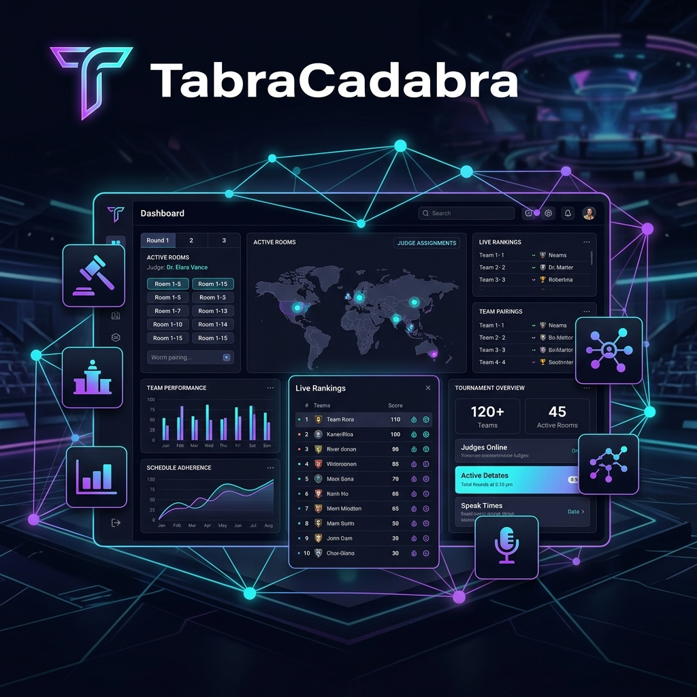

<div align="center">
  
  
  # 📊 TabraCadabra
  ### The Ultimate Competitive Debate Suite
  
  **Run entire tournaments from one modern workspace. Built for convenors, tab, adjudication cores, and teams.**

  [Features](#-key-features) • [Tech Stack](#-tech-stack) • [Structure](#-project-structure) • [Getting Started](#-getting-started)
</div>

<br />

---

## 🚀 Overview

**TabraCadabra** is a comprehensive, all-in-one platform designed to streamline the complexities of competitive debating. Whether you are a tournament director managing logistics, a tab officer running rounds, or a debater tracking your competitive journey, TabraCadabra provides the tools you need in a sleek, high-performance interface.

## ✨ Key Features

### 🏛️ For Convenors & Organizers
- **One-Click Tournament Creation**: Fully customizable setup for any debate format.
- **Smart Registration**: Generate public registration links with secure token-based access.
- **Venue Management**: Track and assign physical or digital rooms.
- **Adjudicator Coordination**: Manage pool eligibility, clashes, and feedback.

### 📈 For the Tab Room
- **Automated Standings**: Real-time calculations for team points and speaker scores.
- **Round Management**: Easy motion release and round scheduling.
- **The Break**: Dynamic tracking of team breaks and speaker tabs.
- **Digital Ballots**: Seamless feedback and score submission flow.

### 👤 For Participants
- **The Journey (Resume)**: A permanent record of your tournament history, break rates, and cumulative speaks.
- **Live Tournament Dashboard**: Real-time access to motions, announcements, and pairings.
- **Communication Suite**: Integrated chat and "Voice Rooms" for prep and socialization.

## 🛠️ Tech Stack

- **Frontend**: [Vite](https://vitejs.dev/) + Vanilla JavaScript (Modern ES6+)
- **Styling**: Vanilla CSS with a custom design system
- **Backend/Database**: [Supabase](https://supabase.com/) (Auth, Database, Edge Functions)
- **Typography**: Inter & Poppins via Google Fonts

## 📁 Project Structure

```text
├── js/
│   ├── components/     # Reusable UI elements (Modals, Nav, Cards)
│   ├── data/           # Constants and configuration
│   ├── lib/            # Supabase client and shared utilities
│   ├── pages/          # Page-specific logic and renders
│   │   ├── tournament/ # Management-specific views (Tab, Teams, etc.)
│   │   └── ...         # Core user views (Dashboard, Profile)
│   └── app.js          # Main router and app gateway
├── public/             # Static assets and images
├── style.css           # Global design system and component styles
├── index.html          # Entry point
└── package.json        # Dependencies and scripts
```

## 🏁 Getting Started

### Prerequisites
- Node.js (v18+)
- A Supabase project

### Installation

1. **Clone the repository**
   ```bash
   git clone https://github.com/itsbisid/Tabracadabra.git
   cd Tabracadabra
   ```

2. **Install dependencies**
   ```bash
   npm install
   ```

3. **Environment Setup**
   Create a `.env` file in the root and add your Supabase credentials. Add SMTP settings only if you want app-triggered registration emails and private portal links to be sent automatically:
   ```env
   VITE_SUPABASE_URL=your_project_url
   VITE_SUPABASE_ANON_KEY=your_anon_key

   SMTP_HOST=smtp.gmail.com
   SMTP_PORT=465
   SMTP_SECURE=true
   SMTP_USER=your_email@gmail.com
   SMTP_PASS=your_gmail_app_password
   SMTP_FROM=TabraCadabra <your_email@gmail.com>
   SMTP_REPLY_TO=your_email@gmail.com

   ASHESI_SMTP_HOST=smtp.gmail.com
   ASHESI_SMTP_PORT=465
   ASHESI_SMTP_SECURE=true
   ASHESI_SMTP_USER=your_ashesi_email@ashesi.edu.gh
   ASHESI_SMTP_PASS=your_ashesi_google_app_password
   ASHESI_SMTP_FROM=TabraCadabra <your_ashesi_email@ashesi.edu.gh>
   ASHESI_SMTP_REPLY_TO=your_ashesi_email@ashesi.edu.gh
   ```
   Keep `SMTP_PASS` server-side only. Do not prefix it with `VITE_`.
   If the Ashesi SMTP variables are set, emails to `@ashesi.edu.gh` recipients use the Ashesi sender automatically. Other recipients use the default SMTP sender.

4. **Launch Development Server**
   ```bash
   npm run dev
   ```

---

<div align="center">
  <p>Built with ❤️ by the TabraCadabra Team</p>
</div>

